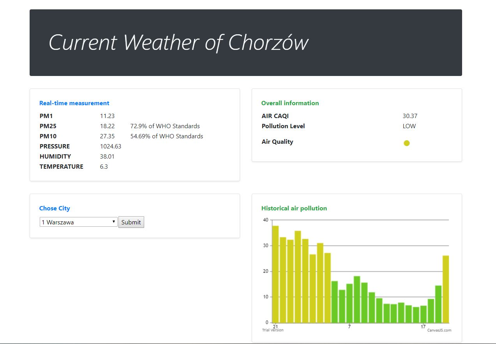
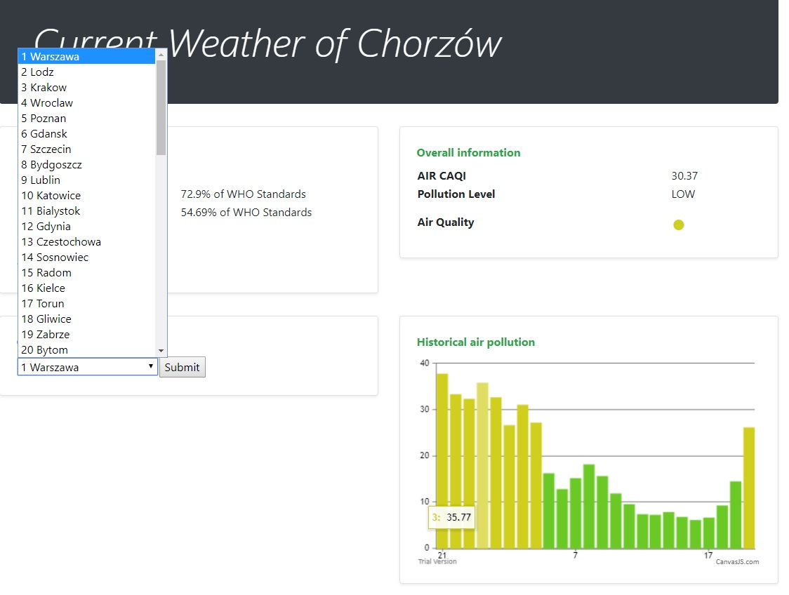
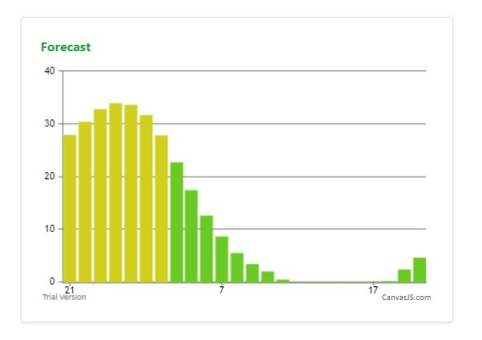

# Pollution checker

## Table of contents
* [General info](#general-info)
* [Screenshots](#screenshots)
* [Technologies](#technologies)
* [Features](#features)
* [Status](#status)
* [Inspiration](#inspiration)
* [Contact](#contact)

## General info
This application created for receiving information about Air Pollution and Weather condition.

## Screenshots
Main page with information about Air condition.

You can chose City, application receiving information form JSON file with coordination of city name.

Last update add forecast

## Technologies
* Spring Boot - version 2.0.5
* Lombok
* Maven
* JS
* CSS - bootstrap

## Features
List of features ready and TODOs for future development

* Information about current air pollution according to WHO standards.
* Forecast which give help us to prepare for future air condition

To-do list:
* Receiving information about air condition based on coordination.
* Add more charts with temperature etc.
* Cover most part of application with unit tests and integration tests.
* Add more friendly UI.

## Status
Project is: _in progress_
A lot of things to do and improvement.
## Inspiration
Project inspired by https://airly.eu which provide me API for this application.

## Contact
Created by Dawid Paprocki [Linkedin](https://www.linkedin.com/in/dawid-paprocki/)
